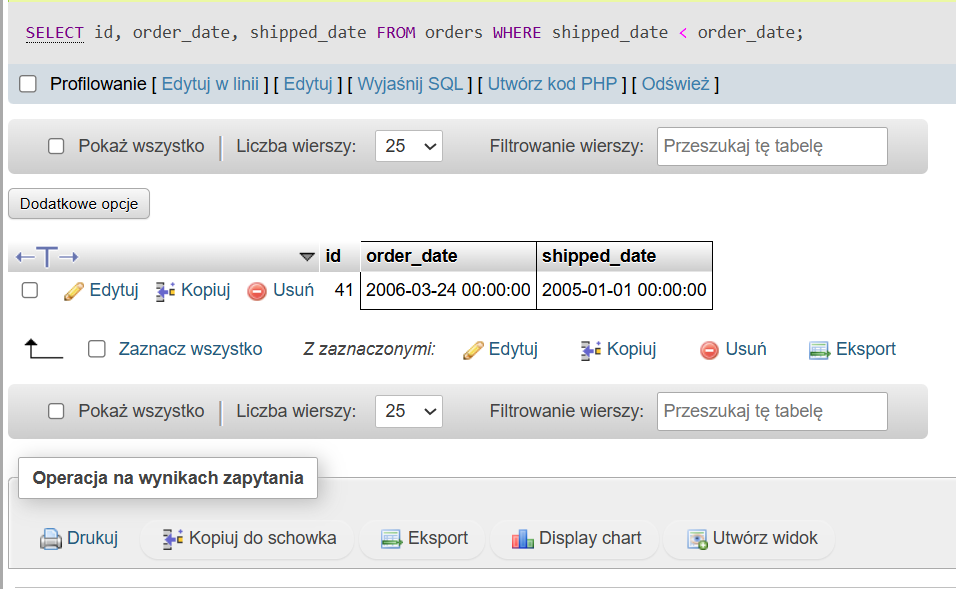

# BUG-001: Order shipped before order date

## Summary
The system contains an order where the shipped date is earlier than the order date.

---

## Environment
- Database: Northwind
- Tool: phpMyAdmin
- OS: Windows
- Browser: Chrome

---

## Preconditions
The orders table contains existing order records.

---

## Steps to Reproduce
1. Open phpMyAdmin.
2. Open the `orders` table.
3. Run the following query:

```sql
SELECT id, order_date, shipped_date
FROM orders
WHERE shipped_date < order_date;
```

4. Review the returned results.

---

## Expected Result
The shipped date should always be later than or equal to the order date.

---

## Actual Result
The query returned 1 row where the shipped date is earlier than the order date.

Example:
- Order ID: 41
- Order Date: 2006-03-24
- Shipped Date: 2005-01-01

---

## Severity
High

---

## Priority
High

---

## Frequency
Always reproducible

---

## Evidence
See screenshot:



---

## Notes
This issue may affect:
- reporting accuracy,
- shipment tracking,
- business analytics,
- customer trust,
- financial calculations.
